# 🏢 TenantOPS — B2B SaaS Infrastructure Monitoring Platform

<div align="center">


**A production-grade DevOps portfolio project — B2B Infrastructure Monitoring Platform with complete CI/CD pipeline on AWS EKS**

[Quick Start](#-quick-start) · [Architecture](#-architecture) · [CI/CD Pipeline](#-cicd-pipeline) · [Deploy to AWS](#-deploy-to-aws) · [Agent Setup](#-agent-setup)

</div>

---

## 📌 What is TenantOPS?

TenantOPS is a **B2B SaaS infrastructure monitoring platform** that gives engineering teams complete visibility into their servers, services, and infrastructure — all from a single unified dashboard.

Think of it as your own self-hosted infrastructure intelligence layer: real-time metrics, agent-based collection, multi-tenant isolation, alerting, and log aggregation — built and deployed using a fully automated DevOps pipeline.

| Category | Technologies |
|----------|-------------|
| **Application** | React 18, Node.js/Express, Python 3.11, PostgreSQL 15 |
| **Containerization** | Docker, Docker Compose, Multi-stage builds |
| **IaC** | Terraform (VPC, EKS, IAM, S3, Secrets Manager) |
| **Orchestration** | Kubernetes on AWS EKS |
| **Package Management** | Helm Charts |
| **GitOps** | ArgoCD (auto-sync, self-heal) |
| **CI/CD** | Jenkins + Kaniko + Trivy on Kubernetes |
| **Observability** | Prometheus + Grafana |

---

## ✨ Features

- 🖥️ **Real-time server monitoring** — CPU, RAM, Disk, Network per server
- 🏢 **Multi-tenant architecture** — each client fully isolated
- 🤖 **Agent-based collection** — one-liner install on any Linux server
- 🔔 **Alert rules engine** — custom rules targeting specific servers/services
- 📊 **Time-series metrics** — charts with date/time range filter
- 📋 **Integrated log viewer** — system logs, Docker logs, SSH logs
- 🌙 **Dark/Light mode** — glass-morphism UI
- 🔐 **JWT authentication** — with full audit logging

---

## 📸 Screenshots

### Application

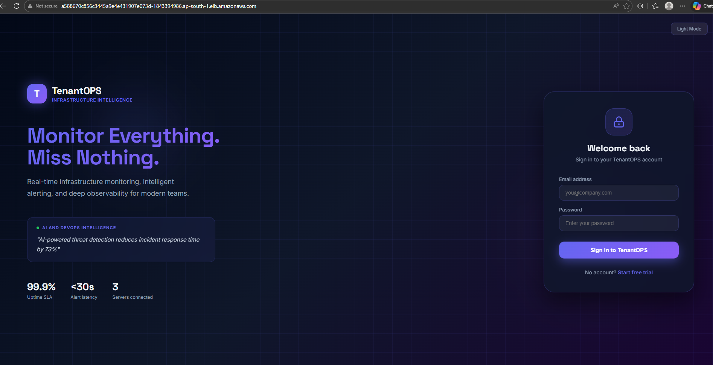
*TenantOPS — live on AWS EKS via Elastic Load Balancer*

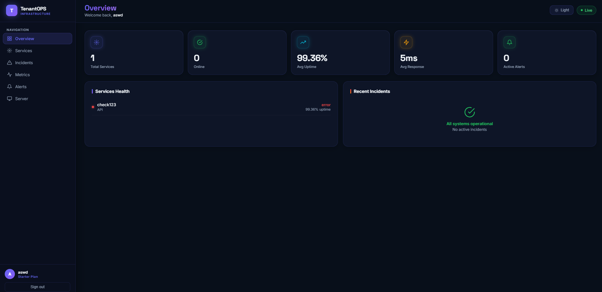
*Main dashboard — real-time infrastructure overview with service health*

### Infrastructure

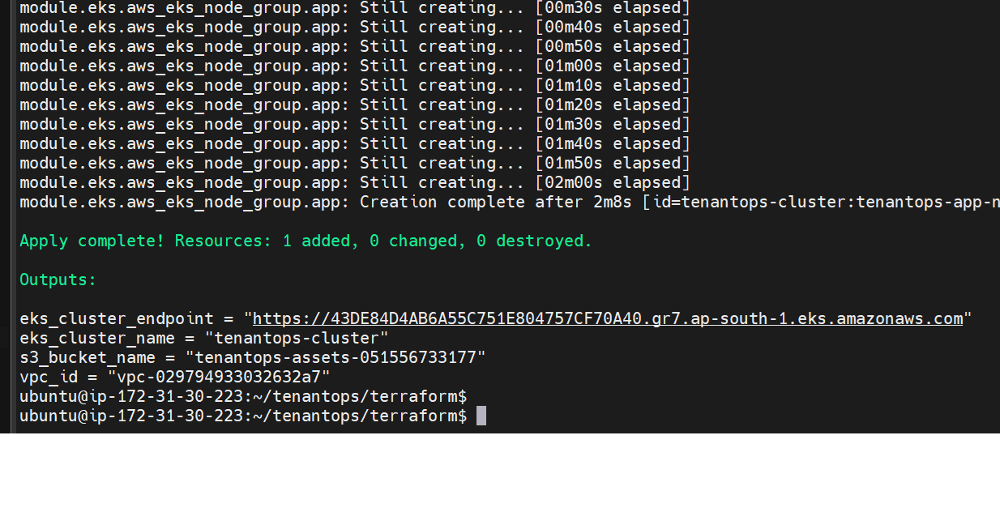
*Terraform apply complete — EKS cluster and VPC outputs*

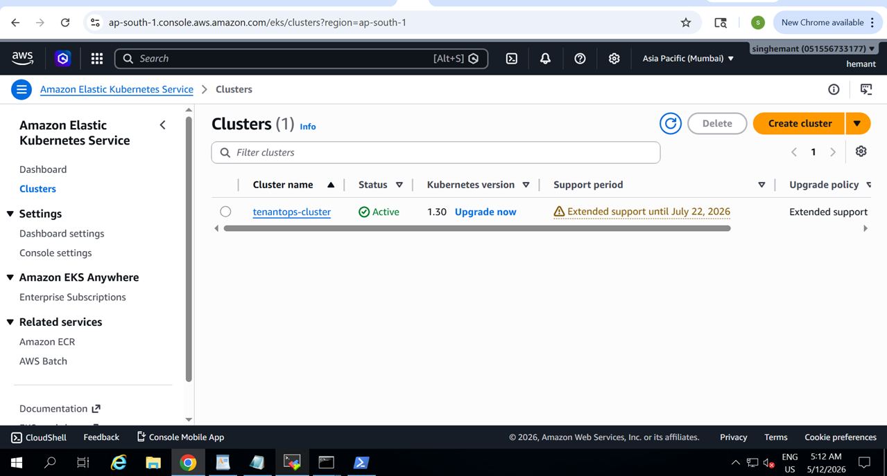
*AWS EKS Console — tenantops-cluster Active (Kubernetes 1.30)*

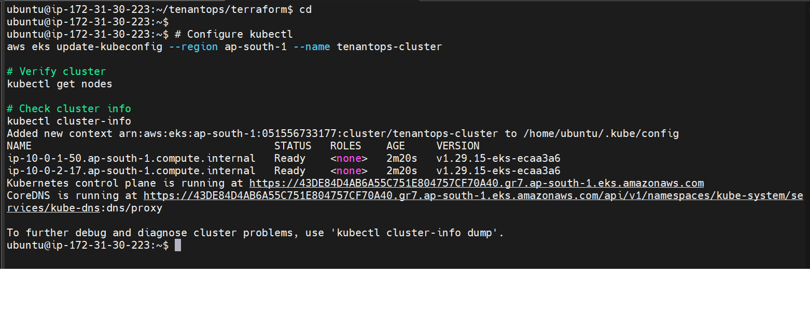
*kubectl get nodes — 2 worker nodes Ready after terraform apply*

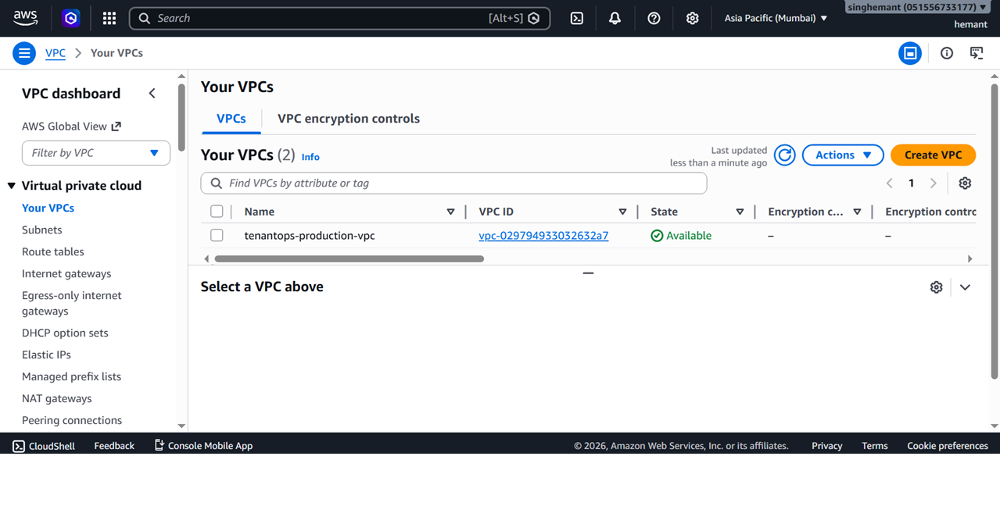
*AWS VPC — tenantops-production-vpc created by Terraform*

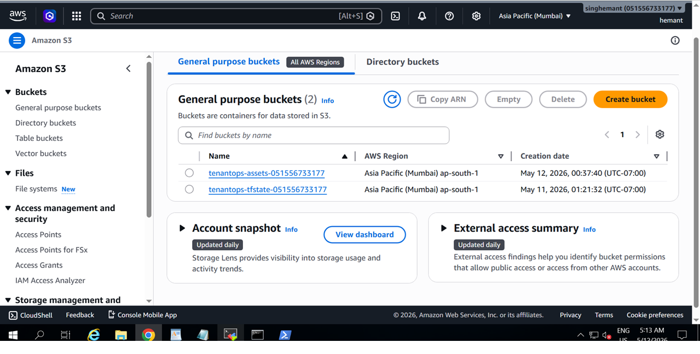
*S3 — Terraform state bucket and assets bucket*

### Kubernetes

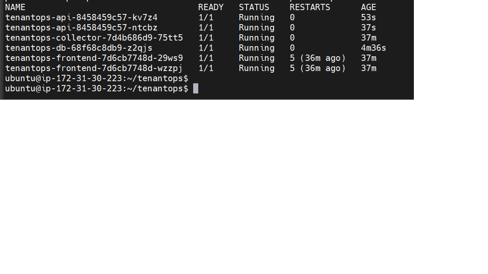
*kubectl get pods — all services Running in tenantops namespace*

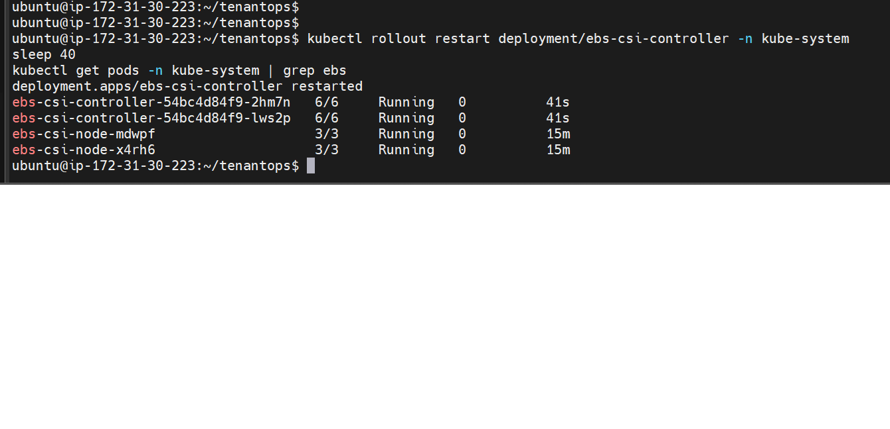
*EBS CSI driver — controller and node pods Running in kube-system*

### GitOps — ArgoCD

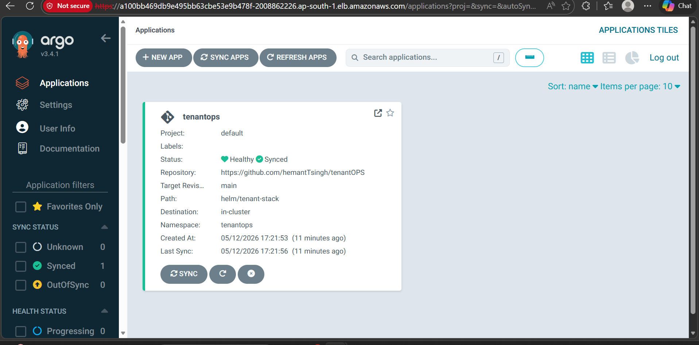
*ArgoCD — tenantops application Healthy and Synced to main branch*

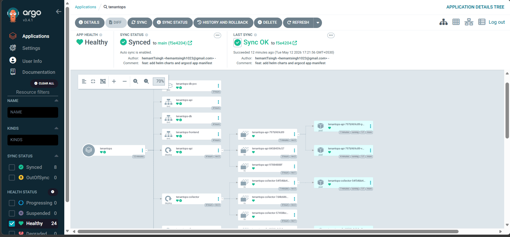
*ArgoCD resource tree — all 24 resources Healthy*

### Observability — Grafana

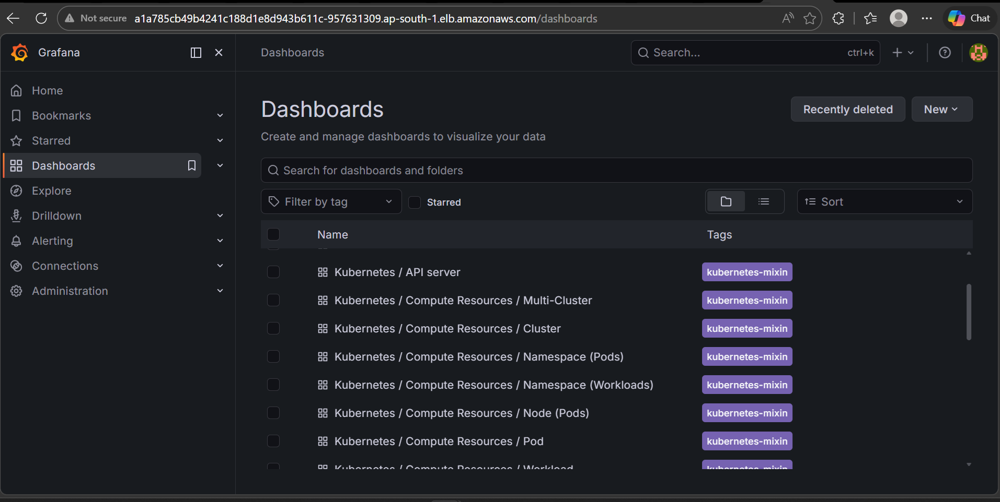
*Grafana — Kubernetes dashboards auto-provisioned by kube-prometheus-stack*

### CI/CD — Jenkins

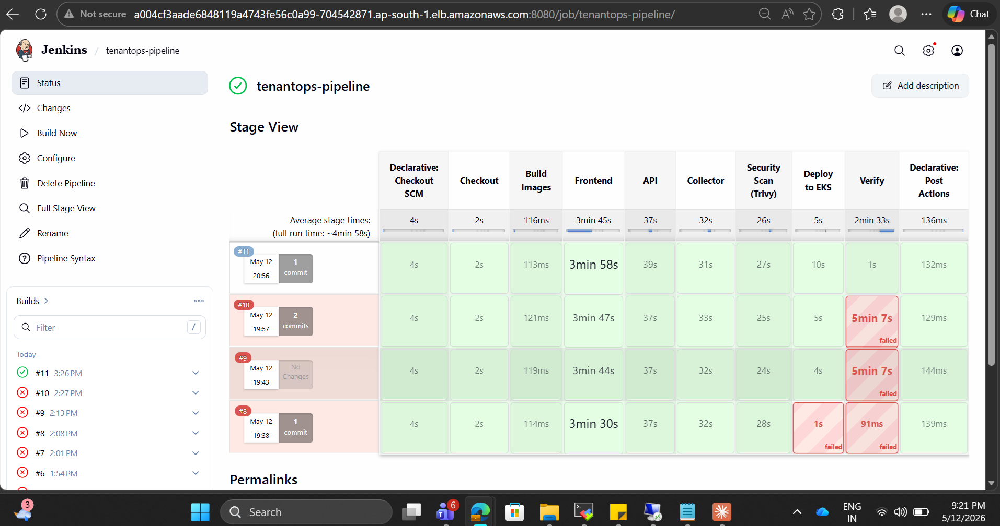
*Jenkins pipeline — Build #11 ALL STAGES GREEN ✅*

---

## 🏗️ Architecture

### Application Stack

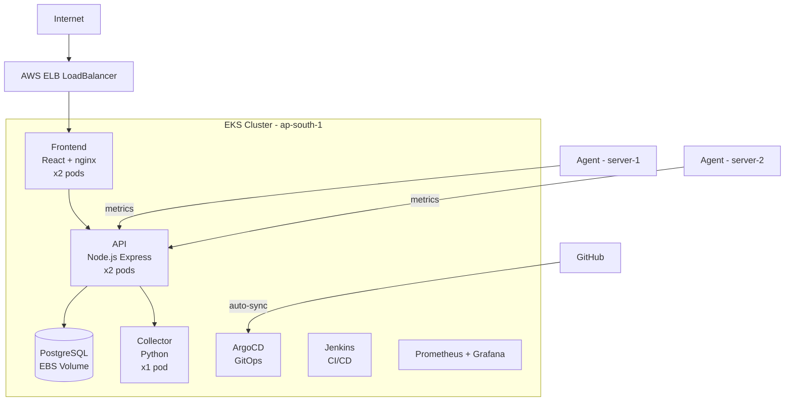

### AWS Infrastructure

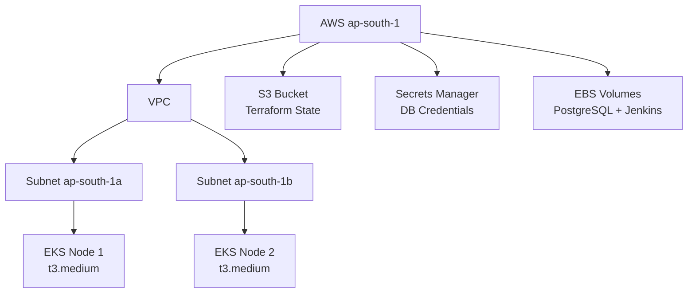

### Kubernetes Namespaces

| Namespace | Services |
|-----------|---------|
| `tenantops` | frontend (x2), api (x2), collector (x1), db (x1) |
| `jenkins` | Jenkins controller + dynamic kaniko agent pods |
| `argocd` | ArgoCD server, repo-server, app-controller |
| `monitoring` | Prometheus, Grafana, AlertManager, node-exporter |

---

## 🔄 CI/CD Pipeline

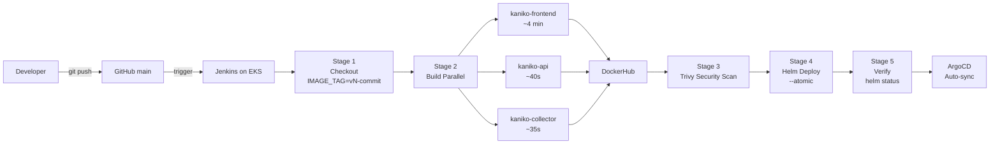

> **Why Kaniko?** EKS uses containerd runtime — no Docker socket available.
> Kaniko builds OCI-compliant images inside Kubernetes pods without needing a Docker daemon.

---

## 🚀 Quick Start

### Prerequisites

- Docker and Docker Compose
- Node.js 20+, Python 3.11+, Git

### 1. Clone

```bash
git clone https://github.com/hemantTsingh/tenantOPS.git
cd tenantOPS
```

### 2. Configure environment

```bash
cp services/tenant-api/.env.example services/tenant-api/.env
cp services/metrics-collector/.env.example services/metrics-collector/.env
nano services/tenant-api/.env
```

### 3. Start with Docker Compose

```bash
docker compose up -d
docker compose logs -f
```

### 4. Access

| Service | URL |
|---------|-----|
| TenantOPS UI | http://localhost:3000 |
| API | http://localhost:4000 |
| API Health | http://localhost:4000/health |

> Configure your credentials in `services/tenant-api/.env` before first login.

---

## 🤖 Agent Setup

Install the TenantOPS agent on any Linux server with a single command:

```bash
SERVER_NAME="my-server" \
TENANTOPS_API="http://YOUR_SERVER_IP:4000" \
curl -s http://YOUR_SERVER_IP:4000/api/agent/install | sudo bash
```

The agent:
- Installs in an isolated Python venv at `/opt/tenantops-agent/`
- Runs as a systemd service: `tenantops-agent`
- Auto-starts on reboot
- Collects: CPU, RAM, Disk, Network, Processes, Docker containers, System logs

```bash
# Check status
sudo systemctl status tenantops-agent

# View live logs
sudo journalctl -u tenantops-agent -f

# Restart
sudo systemctl restart tenantops-agent
```

---

## ☁️ Deploy to AWS

### Prerequisites

- AWS CLI configured (`aws configure`)
- Terraform >= 1.5
- kubectl
- Helm >= 3.12

### Step 1 — Infrastructure (Terraform)

```bash
cd terraform
cp terraform.tfvars.example terraform.tfvars
# Edit terraform.tfvars with your AWS details
terraform init
terraform plan
terraform apply
```

Creates: VPC (2 AZs), EKS cluster (2x t3.medium), IAM roles, EBS CSI driver, S3 state bucket, Secrets Manager entry.

### Step 2 — Configure kubectl

```bash
aws eks update-kubeconfig --name tenantops-cluster --region YOUR_REGION
kubectl get nodes
```

### Step 3 — Deploy Application (Helm)

```bash
helm upgrade --install tenantops ./helm/tenant-stack \
  --namespace tenantops --create-namespace \
  --set frontend.tag=latest \
  --set api.tag=latest \
  --set collector.tag=latest \
  --wait
```

### Step 4 — Install ArgoCD

```bash
kubectl create namespace argocd
kubectl apply -n argocd \
  -f https://raw.githubusercontent.com/argoproj/argo-cd/stable/manifests/install.yaml
kubectl patch svc argocd-server -n argocd \
  -p '{"spec":{"type":"LoadBalancer"}}'
kubectl apply -f k8s/argocd-app.yaml
```

### Step 5 — Prometheus + Grafana

```bash
helm repo add prometheus-community \
  https://prometheus-community.github.io/helm-charts
helm upgrade --install monitoring \
  prometheus-community/kube-prometheus-stack \
  --namespace monitoring --create-namespace \
  --set grafana.adminPassword=YOUR_SECURE_PASSWORD \
  --set grafana.service.type=LoadBalancer
```

### Step 6 — Jenkins

```bash
helm repo add jenkins https://charts.jenkins.io
helm upgrade --install jenkins jenkins/jenkins \
  --namespace jenkins --create-namespace \
  --set controller.serviceType=LoadBalancer \
  --set controller.admin.password=YOUR_SECURE_PASSWORD \
  --set persistence.enabled=true

# DockerHub secret for kaniko image builds
kubectl create secret docker-registry dockerhub-secret \
  --docker-server=https://index.docker.io/v1/ \
  --docker-username=YOUR_DOCKERHUB_USERNAME \
  --docker-password=YOUR_DOCKERHUB_PAT \
  --namespace=jenkins

# Grant Jenkins cluster permissions
kubectl create clusterrolebinding jenkins-deploy \
  --clusterrole=cluster-admin \
  --serviceaccount=jenkins:jenkins
```

### Step 7 — Configure Jenkins Pipeline

1. Jenkins UI → **New Item** → **Pipeline**
2. Pipeline script from SCM → Git
3. Repository: `https://github.com/YOUR_USERNAME/tenantOPS`
4. Branch: `*/main` — Script Path: `Jenkinsfile`
5. Add DockerHub credentials (ID: `dockerhub-credentials`)

---

## 📁 Project Structure

```
tenantOPS/
├── services/
│   ├── frontend/            # React 18 + nginx
│   │   ├── src/
│   │   ├── nginx.conf
│   │   └── Dockerfile       # Multi-stage build
│   ├── tenant-api/          # Node.js Express REST API
│   │   ├── src/routes/      # auth, agent, alerts, metrics
│   │   ├── .env.example
│   │   └── Dockerfile
│   └── metrics-collector/   # Python + psutil agent collector
│       ├── src/
│       ├── .env.example
│       └── Dockerfile
├── helm/tenant-stack/       # Helm chart for all services
│   ├── Chart.yaml
│   ├── values.yaml
│   └── templates/
├── terraform/               # Infrastructure as Code
│   ├── modules/vpc/
│   ├── modules/eks/
│   ├── modules/iam/
│   └── terraform.tfvars.example
├── k8s/
│   └── argocd-app.yaml      # ArgoCD Application manifest
├── docs/
│   └── screenshots/         # Project screenshots
├── Jenkinsfile              # CI/CD pipeline definition
└── docker-compose.yml       # Local development
```

---

## 🔧 Environment Variables

### API (`services/tenant-api/.env`)

```env
DB_HOST=localhost
DB_PORT=5432
DB_NAME=tenantops
DB_USER=postgres
DB_PASSWORD=your_secure_password_here
JWT_SECRET=your_jwt_secret_minimum_32_characters
PORT=4000
NODE_ENV=development
```

### Collector (`services/metrics-collector/.env`)

```env
TENANTOPS_API=http://localhost:4000
COLLECTION_INTERVAL=60
SERVER_NAME=my-server
```

---

## 🔒 Security Notes

- Never commit `.env` files — already in `.gitignore`
- Change default credentials immediately after first login
- Trivy security scans run on every CI/CD build — review findings
- Use AWS Secrets Manager or Sealed Secrets in production
- Scope Jenkins RBAC to `tenantops` namespace in production (not cluster-admin)

---

## 🛠️ Troubleshooting

```bash
# Pod crashed
kubectl describe pod <name> -n tenantops
kubectl logs <name> -n tenantops --previous

# DB connection failed — ensure DB_PASSWORD env var (not DB_PASS)
kubectl exec -it <api-pod> -n tenantops -- env | grep DB

# EBS PVC stuck Pending — check EBS CSI driver
kubectl get pods -n kube-system | grep ebs-csi
kubectl describe pvc -n tenantops

# ArgoCD out of sync — force refresh
kubectl patch application tenantops -n argocd \
  --type merge \
  -p '{"metadata":{"annotations":{"argocd.argoproj.io/refresh":"hard"}}}'

# Agent not reporting
sudo systemctl restart tenantops-agent
sudo journalctl -u tenantops-agent -f
```

---

## 🤝 Contributing

1. Fork the repository
2. Create feature branch: `git checkout -b feature/my-feature`
3. Commit: `git commit -m 'feat: add my feature'`
4. Push: `git push origin feature/my-feature`
5. Open a Pull Request

---

## 📄 License

MIT License — see [LICENSE](LICENSE)

---

<div align="center">
Built with ❤️ as a production-grade DevOps portfolio project.
<br><br>
<b>Every bug was a lesson. Every fix made it stronger. 🚀</b>
</div>
